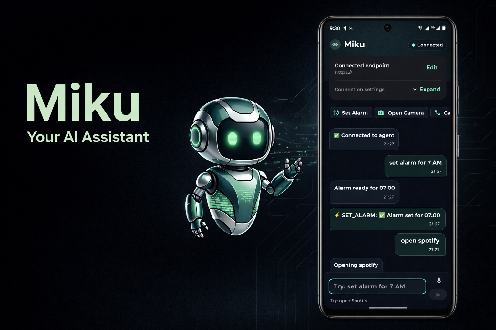
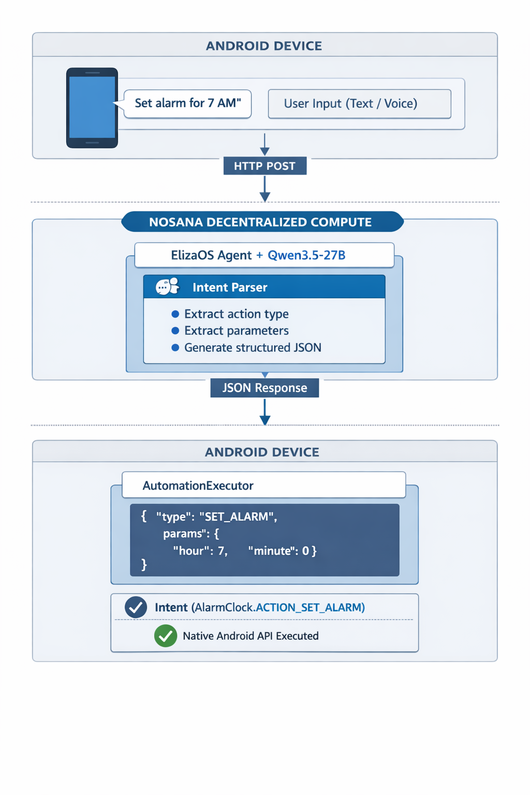

# Miku



# Demo
[watch demo](https://youtube.com/shorts/E8rhWCiAgkI?si=n0JTcMFXoQ3yQR9_)

[](https://github.com/Lexiie/miku/actions/workflows/android-release.yml)
[](https://github.com/Lexiie/miku/actions/workflows/build-debug-apk.yml)
[](https://github.com/Lexiie/miku/actions/workflows/deploy-docker-elizaos.yml)
[](https://github.com/Lexiie/miku/actions/workflows/deploy-nosana.yml)


[](LICENSE)

**Your Personal AI Assistant for Android Automation**

Miku transforms natural language into native Android actions. No more tapping through menus, just tell Miku what you want, and it happens instantly.

Built on ElizaOS with decentralized inference, Miku bridges conversational AI with deep Android system integration, giving you voice-controlled automation that runs on your terms.

---

## 🎯 What Makes Miku Different

**True Native Integration** — Unlike chatbots that only reply with text, Miku executes real Android API calls. Set alarms, toggle WiFi, send SMS, control brightness, and launch apps through natural language.

**Decentralized Intelligence** — Your agent runs on Nosana's distributed GPU network instead of a traditional centralized host. You control the infrastructure and keep the Android execution layer on your own device.

**Fast to Start** — Deploy the agent, install the app, connect the endpoint, and start automating. The repo keeps the moving pieces separated so the path from clone to demo stays simple.

**Hybrid Architecture** — ElizaOS handles intent parsing and response formatting, while native Android APIs handle execution. That split keeps the assistant flexible without giving up local device control.

---

## ✨ Capabilities

### ⏰ Time Management
- **Set Alarm** — "Set alarm for 7 AM tomorrow"
- **Set Timer** — "Timer for 10 minutes"
- **Calendar Events** — "Add meeting with John at 2 PM"
- **View Schedule** — "What's on my calendar today?"
- **Reminders** — "Remind me to call mom in 30 minutes"

### 📱 Communication
- **Send SMS** — "Text 081234567890 saying I'm running late"
- **Make Calls** — "Call 081234567890"
- **Notifications** — "Notify me to take a break"

### 🔧 System Control
- **WiFi** — "Turn on WiFi" / "Disable WiFi"
- **Bluetooth** — "Enable Bluetooth"
- **Flashlight** — "Turn on flashlight"
- **Brightness** — "Set brightness to 80%"
- **Volume** — "Set volume to 50%"
- **Ringer Mode** — "Set phone to silent" / "Vibrate mode"

### 📍 Location & Apps
- **Get Location** — "Where am I?"
- **Open Apps** — "Open Spotify"
- **Uninstall Apps** — "Uninstall Twitter"

---

## 🏗️ Architecture

Miku uses a **hybrid client-server architecture** where intelligence lives remotely and execution happens locally:



**Why This Architecture?**

- **Separation of Concerns** — AI inference happens on remote compute, execution happens locally on the device
- **Privacy** — Sensitive actions such as SMS and calls never need to be executed in the cloud
- **Scalability** — One agent can serve multiple devices while each phone keeps its own permissions and execution state
- **Flexibility** — You can change prompts, models, and deploy settings without rewriting the Android app

---

## 🚀 Quick Start

### Prerequisites

- **Docker Hub account**
- **GitHub account** with Actions enabled
- **Nosana API key** from [deploy.nosana.com](https://deploy.nosana.com/account/)
- **Gemini API key** for the current GitHub Actions deploy flow
- **Android device** (API 26+)

### Step 1: Configure GitHub Secrets

Go to your repo → Settings → Secrets and variables → Actions, then add:

| Secret | Value | Where to Get |
|--------|-------|--------------|
| `DOCKER_USERNAME` | Your Docker Hub username | [hub.docker.com](https://hub.docker.com) |
| `DOCKER_PASSWORD` | Docker Hub access token | [hub.docker.com/settings/security](https://hub.docker.com/settings/security) |
| `NOSANA_API_KEY` | Nosana API key | [deploy.nosana.com/account](https://deploy.nosana.com/account/) |
| `GEMINI_API_KEY` | Gemini API key required by the current workflow | Google AI Studio or Google Cloud |

The Docker workflow uses `DOCKER_USERNAME` to tag the image automatically, so you do not need to hardcode the image name in the repository first.

Miku started with **Qwen 3.5 27B** as the reference model, but the agent layer can be adapted to other LLMs you wire into ElizaOS, for example OpenAI-compatible endpoints, Claude, GLM, and similar provider integrations.

The checked-in Nosana deploy workflow in this repo currently deploys with `GEMINI_API_KEY`, so if you switch providers or models, update that workflow and the runtime environment together.

### Step 2: Run the Manual Workflows

Run these workflows manually from the **Actions** tab:

1. **Deploy Docker ElizaOS**
   Builds and pushes the agent image to Docker Hub.
2. **Build Debug APK** or **Build Release APK**
   Produces the Android artifact you want to install.
3. **Deploy Nosana**
   Starts the Nosana deployment using the Docker image tag you choose, usually `latest` or a specific commit SHA.

### Step 3: Install & Connect

1. Download the APK from the workflow artifact of **Build Debug APK** or **Build Release APK**.
2. Install it on your Android device.
3. Get the agent URL from the Nosana dashboard.
4. Open the Miku app, enter the URL, and tap `Connect`.
5. Start automating.

---

## 🛠️ Technical Deep Dive

### Intent Parsing Engine

Miku uses a custom ElizaOS action flow that parses natural language into structured JSON:

```typescript
// Input: "Set alarm for 7 AM tomorrow"
// Output:
{
  "text": "⏰ Alarm set for 7:00 AM",
  "actions": [{
    "type": "SET_ALARM",
    "params": {
      "hour": 7,
      "minute": 0,
      "label": "Alarm"
    }
  }]
}
```

The parser handles:
- **Time extraction** — Relative ("in 10 minutes") and absolute ("7 AM")
- **Parameter inference** — Smart defaults when information is missing
- **Phone number extraction** — SMS and call targets from plain text
- **Multi-action commands** — "Turn on WiFi and set brightness to 50%"

### Android Execution Layer

`AutomationExecutor.kt` maps action types to native Android APIs:

| Action Type | Android API | Permission Required |
|-------------|-------------|---------------------|
| `SET_ALARM` | `Intent(AlarmClock.ACTION_SET_ALARM)` | None |
| `SEND_SMS` | `SmsManager.sendTextMessage()` | `SEND_SMS` |
| `TOGGLE_WIFI` | `WifiManager.setWifiEnabled()` | `CHANGE_WIFI_STATE` |
| `SET_BRIGHTNESS` | `Settings.System.putInt()` | `WRITE_SETTINGS` |
| `GET_LOCATION` | `FusedLocationProviderClient` | `ACCESS_FINE_LOCATION` |
| `TOGGLE_FLASHLIGHT` | `CameraManager.setTorchMode()` | `CAMERA` |

**Permission Handling** — Miku requests permissions just-in-time. When you first send SMS, it asks for SMS permission. When you first set brightness, it opens system settings.

For exact scheduled reminders, Miku separately requests Android's exact alarm capability when needed.

### Communication Protocol

**Health Check:**
```http
GET /health
```

**Request:**
```json
POST /api/chat
{
  "text": "Set alarm for 7 AM and turn on WiFi",
  "userId": "android_user"
}
```

**Response:**
```json
{
  "text": "Alarm ready for 07:00. WiFi will be turned on",
  "actions": [
    {
      "type": "SET_ALARM",
      "params": {
        "hour": 7,
        "minute": 0,
        "label": "Alarm"
      }
    },
    {
      "type": "TOGGLE_WIFI",
      "params": {
        "enable": true
      }
    }
  ]
}
```

The Android app checks `/health` before connecting, executes each action sequentially, and displays follow-up status updates in the chat for async actions such as location lookup.

### State Management

Miku uses **Jetpack Compose + ViewModel** for reactive UI:

- `ChatViewModel` — Manages messages, connection state, and API calls
- `AutomationExecutor` — Stateless executor for Android APIs
- `ApiClient` — Retrofit HTTP client with URL normalization and health checks

No local storage is required, all state is ephemeral by design.

---

## 📦 Project Structure

```text
miku/
├── src/                                    # ElizaOS Agent
│   ├── parser.ts                           # Shared natural-language -> action parser
│   ├── actions/
│   │   └── androidAutomation.ts            # Eliza action wrapper for parser output
│   ├── api.ts                              # Plugin routes (/api/chat, /health)
│   └── index.ts                            # Plugin entry point
│
├── android/                                # Android App
│   ├── app/
│   │   ├── build.gradle.kts                # Build config
│   │   └── src/main/
│   │       ├── AndroidManifest.xml         # Permissions & config
│   │       ├── java/com/miku/
│   │       │   ├── MainActivity.kt         # Compose UI
│   │       │   ├── ChatViewModel.kt        # State management
│   │       │   ├── ApiClient.kt            # HTTP client
│   │       │   ├── AutomationExecutor.kt   # Android API executor
│   │       │   ├── ReminderReceiver.kt     # Reminder notifications
│   │       │   └── Models.kt               # Data classes
│   │       └── res/
│   │           ├── values/strings.xml
│   │           └── values/themes.xml
│   ├── build.gradle.kts                    # Root build file
│   ├── settings.gradle.kts                 # Project settings
│   └── gradlew                             # Gradle wrapper
│
├── characters/
│   └── android.character.json              # Agent personality & examples
│
├── nos_job_def/
│   └── nosana_eliza_job_definition.json    # Nosana deployment config template
│
├── .github/workflows/
│   ├── android-release.yml                 # Manual release APK build
│   ├── build-debug-apk.yml                 # Manual debug APK build
│   ├── deploy-docker-elizaos.yml           # Manual Docker build/push
│   └── deploy-nosana.yml                   # Manual Nosana deployment
│
├── Dockerfile                              # Container config
├── package.json                            # Node dependencies
└── README.md                               # This file
```

---

## 🔧 Development

### Local Agent Development

```bash
# Install dependencies
pnpm install

# Copy environment template
cp .env.example .env

# Start the agent in development mode
pnpm dev
```

For local Ollama development, `.env.example` includes an example OpenAI-compatible setup.

Agent runs on `http://localhost:3000`

### Android App Development

```bash
cd android

# Debug build
./gradlew assembleDebug

# Install to connected device
./gradlew installDebug

# Release build
./gradlew assembleRelease
```

APK output: `android/app/build/outputs/apk/`

### Testing Locally

1. Get your computer's local IP.
2. Run the agent locally with `pnpm dev`.
3. In the Miku app, enter `http://YOUR_LOCAL_IP:3000`.
4. Ensure the phone and computer are on the same WiFi network.

---

## 🚢 Deployment

### Manual GitHub Actions Deployment (Recommended)

GitHub Actions handles the maintained deployment path for this repo, but each workflow is triggered manually.

If you already followed **Quick Start**, there is no extra setup here. Run the workflows in the order you need:
1. `deploy-docker-elizaos.yml`
2. `build-debug-apk.yml` or `android-release.yml`
3. `deploy-nosana.yml`

### Manual Deployment

The maintained manual flow lives in these workflow files:
- `.github/workflows/android-release.yml`
- `.github/workflows/build-debug-apk.yml`
- `.github/workflows/deploy-docker-elizaos.yml`
- `.github/workflows/deploy-nosana.yml`

The Nosana deployment flow uses:
- market discovery via `/api/markets/`
- deployment creation via `/api/deployments/create`
- deployment start via `/api/deployments/{id}/start`

---

## 📱 Android App Features

### Chat Interface
- **Material Design 3** — Modern, clean UI with dynamic theming
- **Real-time messaging** — Instant feedback on action execution
- **Auto-scroll** — Always shows the latest messages

### Endpoint Configuration
- **Manual URL input** — Connect to any compatible ElizaOS agent
- **Health checks** — Validates the endpoint before chat requests begin
- **Error handling** — Graceful fallback on network issues

### Permission Management
- **Just-in-time requests** — Only asks when needed
- **Clear explanations** — Shows why each permission is required
- **Graceful degradation** — Continues working even if some permissions are denied

### Execution Feedback
Every action shows:
- ✅ Success confirmation
- ⚡ Action type executed
- 📊 Result details when available

---

## 🔐 Security & Privacy

**Privacy-First Design:**
- No data collection or analytics
- No cloud storage of messages
- All sensitive actions such as SMS and calls execute locally
- Agent only receives command text, not contact lists or other device-private datasets

**Permission Model:**
- Runtime permissions requested on-demand
- User has full control over what Miku can access
- Permissions can be revoked anytime via Android settings

**Network Security:**
- Deployed endpoints should use HTTPS whenever available
- The Android app currently allows cleartext traffic, which is useful for local development and LAN testing
- No authentication tokens stored on device

---

## 🧪 Testing

### Test Commands

Try these to verify key features:

```text
⏰ Time Management:
- "Set alarm for 7 AM"
- "Set timer 5 minutes"
- "Add meeting tomorrow at 2 PM"

🔧 System Control:
- "Turn on WiFi"
- "Set brightness to 70%"
- "Turn on flashlight"
- "Set phone to silent"

📱 Communication:
- "Send SMS to 081234567890 saying hello"
- "Notify me to take a break"

📍 Location:
- "Where am I?"

📱 Apps:
- "Open Chrome"
```

### Troubleshooting

| Issue | Solution |
|-------|----------|
| **Can't connect to agent** | Verify URL format: `https://xxx.node.k8s.prd.nos.ci` for deployed endpoints, including the protocol. |
| **Permission denied** | Grant permission when prompted, or check Settings → Apps → Miku → Permissions. |
| **Action not executing** | Check Logcat for errors: `adb logcat \| grep Miku`. |
| **Agent not responding** | Check the latest GitHub Actions run and the Nosana dashboard for deployment status. |
| **Build fails** | Ensure JDK 17 is installed: `java -version`. |
| **Gradle sync fails** | Delete `.gradle` and sync again. |

---

## 🎨 Customization

### Modify Agent Behavior

Edit `characters/android.character.json`:

```json
{
  "name": "Miku",
  "system": "Your custom instructions here...",
  "messageExamples": [
    // Add more examples to improve parsing accuracy
  ]
}
```

### Add New Actions

**1. Add to shared parser** (`src/parser.ts`):
```typescript
if (lowerText.includes("screenshot")) {
  pushAction(actions, {
    type: "TAKE_SCREENSHOT",
    params: {}
  });
}
```

**2. Add to Executor** (`android/.../AutomationExecutor.kt`):
```kotlin
"TAKE_SCREENSHOT" -> takeScreenshot(action.params)
```

**3. Implement Android API**:
```kotlin
private fun takeScreenshot(params: Map<String, Any>): String {
    // Your implementation
    return "✅ Screenshot saved"
}
```

### Extend with ElizaOS Plugins

Add more capabilities:

```bash
pnpm add @elizaos/plugin-web-search
```

Update `characters/android.character.json`:
```json
{
  "plugins": [
    "@elizaos/plugin-bootstrap",
    "@elizaos/plugin-openai",
    "@elizaos/plugin-web-search"
  ]
}
```

---

## 🏗️ Tech Stack

### Backend (ElizaOS Agent)
- **Framework:** ElizaOS v2
- **Runtime:** Node.js
- **Reference model:** Qwen3.5-27B
- **Model layer:** OpenAI-compatible endpoints plus other ElizaOS integration paths such as Claude, GLM, and similar providers
- **Local dev option:** Ollama-compatible OpenAI endpoint
- **Inference host:** Nosana decentralized GPU network
- **API:** ElizaOS plugin routes (`/api/chat`, `/health`)
- **Container:** Docker

### Frontend (Android App)
- **Language:** Kotlin
- **UI Framework:** Jetpack Compose (Material Design 3)
- **Architecture:** MVVM (ViewModel + State)
- **HTTP Client:** Retrofit + OkHttp
- **Async:** Kotlin Coroutines
- **Location:** Google Play Services FusedLocationProvider
- **Min SDK:** 26 (Android 8.0)
- **Target SDK:** 35 (Android 15)

### Infrastructure
- **Compute:** Nosana decentralized network
- **CI/CD:** GitHub Actions
- **Container Registry:** Docker Hub
- **Deployment:** Automated via GitHub workflow

---

## 📊 Performance

**Agent Response Time:**
- Intent parsing: ~500ms
- Total round-trip: <2s including network

**Android Execution:**
- Action execution: <100ms for native APIs
- UI update: instant through Compose reactivity

**Resource Usage:**
- APK size: ~8MB
- Memory footprint: ~50MB
- Battery impact: minimal with no persistent background service requirement

---

## 🤝 Contributing

Contributions welcome. Areas for improvement:

- [x] Voice input integration (SpeechRecognizer)
- [x] Multi-step action sequences
- [ ] Action history & undo
- [ ] Widget support
- [ ] Tasker integration
- [ ] More Android APIs (camera, media, sensors)

---

## 📄 License

MIT License - see [LICENSE](LICENSE) file.

---

## 🙏 Acknowledgments

Built with:
- [ElizaOS](https://elizaos.com) - AI agent framework
- [Nosana](https://nosana.com) - Decentralized compute
- [Qwen](https://huggingface.co/Qwen) - Open-source model family used as the original reference point

---

**Miku** — Your device, your assistant, your control. 🤖✨
